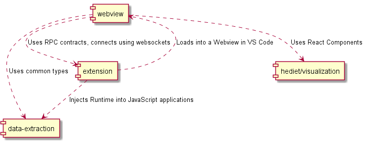

# Contributing

This document extends the [readme](./extension/README.md) of the extension with implementation details.

## Build Instructions

-   Clone the repository
-   Run `yarn` in the repository root
-   Run `yarn build`

## Dev Instructions

This project uses yarn workspaces and consists of the sub-projects _data-extraction_, _extension_ and _webview_.
To setup a dev environment, follow these steps:

-   Clone the repository
-   Run `yarn` in the repository root
-   Run `yarn build` initially (or `yarn dev` for every sub-project)
-   Run `yarn dev` for the sub-project (i.e. in its folder) you are working on.

For the _webview_ project, `yarn dev` will serve the react application on port 8080.
Certain query parameters need to be set, so that the UI can connect to the debug visualizer extension.

You can use VS Code to launch and debug the extension.
Choose the preconfigured `Run Extension (Dev UI)` as debug configuration
so that the extension loads the UI from the webpack server.
Otherwise, the extension will start a webserver on its own, hosting the `dist` folder of the _webview_ project.

## Publish Instructions

-   Follow the Build Instructions
-   `cd extension`
-   `yarn pub`

## Architecture

### webview

Implements the UI and is hosted inside a webview in VS Code.
Can be opened in a browser window.
Uses websockets and JSON RPC to communicate with the extension.

### hediet/visualization

Contains all the visualizers and visualization infrastructure.
This external project can be found [here](https://github.com/hediet/visualization).

### extension

Creates the webview in VS Code, hosts a webserver and a websocket server.
The webserver serves the _webview_ project that is loaded by the webview.
If started with the `Run Extension (Dev UI)` debug configuration, it will load
the page from `http://localhost:8080` rather than from its own http server.

The webview is served from an http server rather than the file system to work around some security mechanisms,
which would prevent lazy chunk loading or websockets.

After the webview is loaded, it connects to the websocket server.
The websocket server is used to evaluate expressions and is secured by a random token.

### data-extraction

Provides types and a JS runtime for data extraction.
